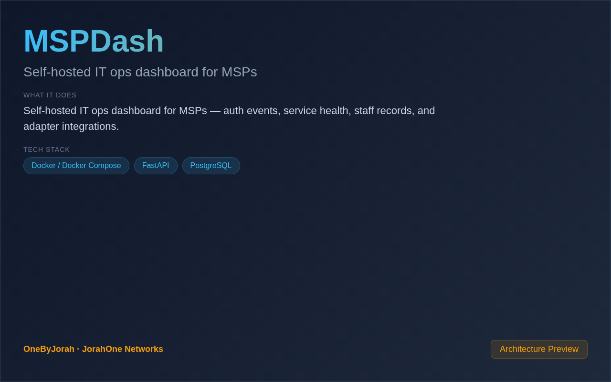

<div align="center">


# MSPDash

Self-hosted IT ops dashboard for MSPs


</div>

---

<p align="center">
  
</p>

<br>

---

## 📸 Screenshot

This is a CLI/backend-only tool. No screenshots available.

## ✨ Features

- **Auth Event Tracking** — Monitor authentication events across systems
- **Service Health** — Real-time service status monitoring
- **Staff Records** — Technician and staff management
- **Adapter Integrations** — Email, osTicket, password reset adapters
- **Self-Hosted** — No SaaS dependencies, full data control
- **TimescaleDB** — Time-series optimized PostgreSQL
- **FastAPI Backend** — Modern async Python backend

## 🚀 Quick Start

```bash
git clone https://github.com/OneByJorah/MSPDash.git
cd MSPDash
cp compose.env.example .env
docker compose up -d
```

Open **http://localhost:3000** in your browser (or the port configured via `DASHBOARD_PORT` in `.env`).

## 🏗️ Architecture

```
Browser → FastAPI Backend → TimescaleDB
                ↓
         Adapter Layer
         ├── Email (notifications)
         ├── osTicket (ticketing)
         └── Password Reset
```

## 🔌 Adapters

| Adapter | Description |
|---------|-------------|
| **Email** | Email integration for notifications and alerts |
| **osTicket** | Ticket system integration for incident management |
| **Password Reset** | Self-service password reset workflow |

## 📁 Project Structure

```
MSPDash/
├── adapters/              # Integration adapters
│   ├── email/             # Email integration
│   ├── osticket/          # osTicket integration
│   └── password-reset/    # Password reset service
├── admin/                 # Admin UI
├── api/                   # FastAPI backend
├── docker-compose.yml     # Docker deployment
└── README.md
```

## 🐳 Docker

```bash
# Start service
docker compose up -d

# View logs
docker compose logs -f

# Stop service
docker compose down
```

## 📄 License

MIT © Jhonattan L. Jimenez

---

## 🤝 Contributing

See [CONTRIBUTING.md](CONTRIBUTING.md). All contributions follow the [Code of Conduct](CODE_OF_CONDUCT.md).

## 🔒 Security

Found a vulnerability? Please follow our [Security Policy](SECURITY.md) and report privately to `security@jorahone.com`.

## 📄 License

[MIT License](LICENSE) © Jhonattan L. Jimenez (OneByJorah)

---

<p align="center">Built with 🌴 by <a href="https://github.com/OneByJorah">OneByJorah</a> · <a href="https://jorahone.com">jorahone.com</a></p>
