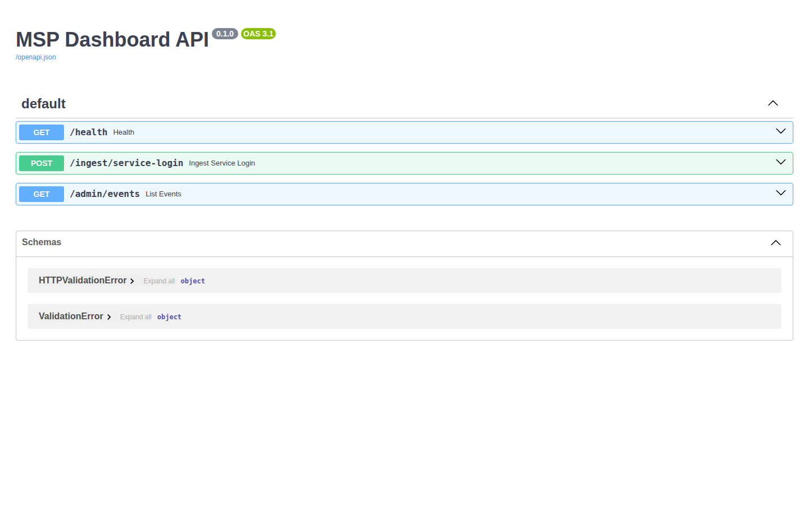

<div align="center">


# MSPDash

**The self-hosted IT operations dashboard for MSPs — authentication events, service health, staff records, and adapter integrations in one interface.**

<a href="https://github.com/OneByJorah/MSPDash/stargazers"></a>
<a href="https://github.com/OneByJorah/MSPDash/commits"></a>


</div>


## What This Is

MSPDash aggregates the operational signals an MSP juggles across many tools — who logged into which service, from where, and when — into a single self-hosted dashboard. Authentication events are ingested per service, linked to staff records, and stored in TimescaleDB for efficient historical querying.

It is designed for small MSP and internal IT teams that want staff login auditing and service visibility without adopting a full ITSM platform, with adapters for email, osTicket, and password reset workflows.

## Quick Start

```bash
git clone https://github.com/OneByJorah/MSPDash.git
cd MSPDash
cp compose.env.example .env    # set SECRET_KEY and DATABASE_URL
docker compose up -d
```

Open **http://localhost:3000**. The API listens on **http://localhost:42000**.

> [!NOTE]
> The dashboard service in the base compose file is a placeholder (`nginxdemos/hello`). The API is the functional component; point it at your own front end or use the static admin view in `admin/index.html`.

## Features

- **Auth event ingestion** — `POST /ingest/service-login` records staff logins per service with source IP, user agent, and metadata.
- **Staff records** — staff are auto-created from ingestion, with optional Telegram IDs for notifications.
- **Service registry** — services are registered on first sight and linked to their events.
- **Event filtering** — query the event log by service with a configurable limit.
- **Adapter layer** — email, osTicket, and password-reset adapters under `adapters/`.
- **Time-series storage** — TimescaleDB (PostgreSQL 16) for efficient historical event retention.
- **Admin view** — a dark static dashboard (`admin/index.html`) listing recent staff login activity.
- **Healthchecked stack** — API waits for a healthy TimescaleDB before starting.

## Architecture

```
Browser → Nginx :3000 → FastAPI :42000 → TimescaleDB
                              ↓
                        Adapter Layer
                        ├── Email
                        ├── osTicket
                        └── Password Reset
```

## Adapters

| Adapter | Path | Description |
|---------|------|-------------|
| **Email** | `adapters/email/adapter.py` | Email notifications and alerts |
| **osTicket** | `adapters/osticket/adapter.py` | Ticket system integration |
| **Password Reset** | `adapters/password-reset/adapter.py` | Self-service password reset workflows |

## Configuration

Copy `compose.env.example` to `.env`.

| Variable | Default | Description |
|----------|---------|-------------|
| `COMPOSE_PROJECT_NAME` | `MSPDash` | Compose project name |
| `ADMIN_USER` | `admin` | Admin username |
| `ADMIN_PASSWORD_BCRYPT` | — | bcrypt hash of the admin password |
| `SECRET_KEY` | `change-me` | App secret — **change this** |
| `DASHBOARD_PORT` | `3000` | Dashboard host port |
| `API_PORT` | `42000` | API host port |
| `DATABASE_URL` | — | SQLAlchemy connection string |
| `POSTGRES_USER` / `POSTGRES_PASSWORD` / `POSTGRES_DB` | `msp` / `change-me` / `msp` | TimescaleDB credentials |
| `TELEGRAM_BOT_TOKEN` | — | Optional Telegram notifications |
| `TELEGRAM_ADMIN_CHAT_ID` | — | Optional admin chat ID |
| `LOG_LEVEL` | `INFO` | Log verbosity |

## API Endpoints

| Endpoint | Method | Description |
|----------|--------|-------------|
| `/health` | GET | Liveness probe |
| `/ingest/service-login` | POST | Record a staff login event |
| `/admin/events` | GET | List auth events (`?service=`, `?limit=50`) |

> [!TIP]
> There is also a `docker-compose.deploy.yml` that joins an external `shared-infrastructure_default` network and maps the API on port **5013** for shared-stack deployments.

## Use Cases

1. **MSPs** — unified view of client infrastructure login activity.
2. **IT departments** — staff management and authentication auditing.
3. **Helpdesks** — ticket-to-alert workflows with the osTicket adapter.

## Tech Stack

FastAPI, uvicorn, SQLAlchemy, Pydantic, psycopg2, TimescaleDB/PostgreSQL 16, Docker Compose.

## Screenshots

| Dashboard |
|---|
|  |

More captures live in [`docs/screenshots/`](docs/screenshots/).

## Contributing

Contributions are welcome — see [CONTRIBUTING.md](CONTRIBUTING.md). [Open an issue](https://github.com/OneByJorah/MSPDash/issues) to report a bug or request a feature.

## License

MIT — see [LICENSE](LICENSE).

## Connect

- [jorahone.com](https://jorahone.com)
- [GitHub Org](https://github.com/OneByJorah)
- [info@jorahone.com](mailto:info@jorahone.com)
