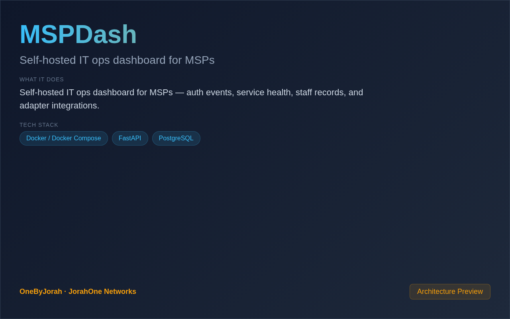

# MSPDash

> Self-hosted IT operations dashboard that ingests per-service authentication events into TimescaleDB and links them to staff records for unified login auditing.

[](https://github.com/OneByJorah/MSPDash)
[](https://github.com/OneByJorah/MSPDash)
[](https://github.com/OneByJorah/MSPDash/stargazers)
[](https://github.com/OneByJorah/MSPDash/commits)
[](https://github.com/OneByJorah/MSPDash/actions/workflows/ci.yml)



## What This Is

MSPDash aggregates operational signals an MSP juggles across many tools into one dashboard: which staff logged into which service, from where, and when. The FastAPI backend records auth events per service, auto-creates staff records on first sight, and stores everything in TimescaleDB for efficient historical querying. Adapters for email, osTicket, and password-reset workflows extend it beyond raw ingestion.

## Quick Start

```bash
git clone https://github.com/OneByJorah/MSPDash.git
cd MSPDash
cp compose.env.example .env    # set SECRET_KEY and DATABASE_URL
docker compose up -d
```

Open the static admin view at **http://localhost:3000**; the API listens on **http://localhost:42000**.

## Features

- `POST /ingest/service-login` auth-event ingestion with source IP, user agent, and metadata.
- Auto-registered services and auto-created staff records with optional Telegram IDs.
- Event querying by service with a configurable limit.
- Adapter layer: email, osTicket, and password-reset integrations under `adapters/`.
- TimescaleDB (PostgreSQL 16) time-series retention.
- Dark static admin dashboard (`admin/index.html`) for recent staff login activity.
- Healthchecked Compose stack — API waits for a healthy database.

## Architecture

```
Browser → Nginx :3000 → FastAPI :42000 → TimescaleDB
                              ↓
                        Adapter Layer
                        ├── Email
                        ├── osTicket
                        └── Password Reset
```

A `docker-compose.deploy.yml` joins an external `shared-infrastructure_default` network and maps the API on port 5013 for shared-stack deployments.

## API Endpoints

| Endpoint | Method | Description |
|---|---|---|
| `/health` | GET | Liveness probe |
| `/ingest/service-login` | POST | Record a staff login event |
| `/admin/events` | GET | List auth events (`?service=`, `?limit=50`) |

## Stack

Python 3.11 · FastAPI · uvicorn · SQLAlchemy · Pydantic · psycopg2 · TimescaleDB/PostgreSQL 16 · Docker Compose.

## Contributing

See [CONTRIBUTING.md](CONTRIBUTING.md). [Open an issue](https://github.com/OneByJorah/MSPDash/issues) to report a bug or request a feature.

## License

MIT — see [LICENSE](LICENSE).
